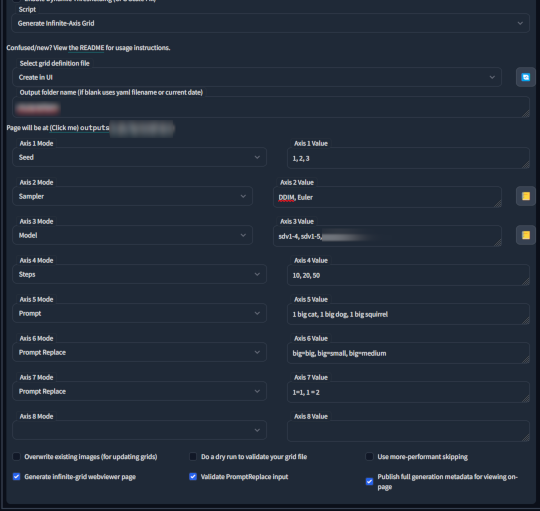
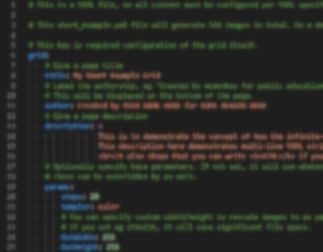
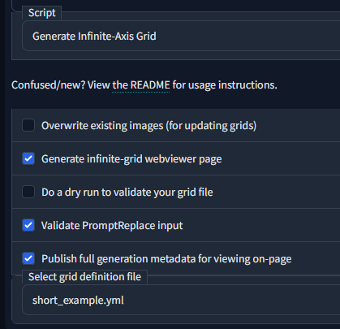
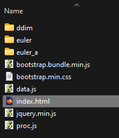
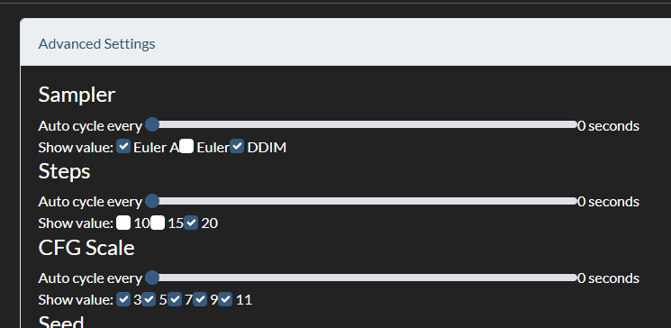
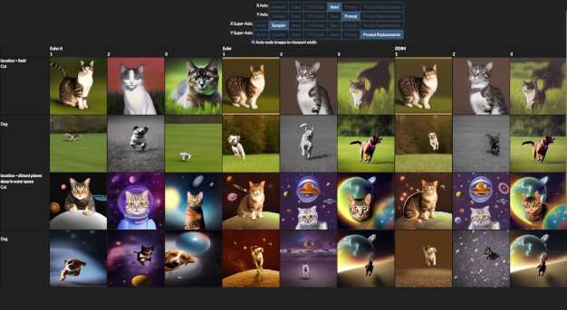

# Stable Diffusion Infinity Grid Generator


### Concept

Extension for the [AUTOMATIC1111 Stable Diffusion WebUI](https://github.com/AUTOMATIC1111/stable-diffusion-webui) that generates infinite-dimensional grids.

An "infinite axis grid" is like an X/Y plot grid, but with, well, more axes on it. Of course, monitors are 2D, so this is implemented in practice by generating a webpage that lets you select which two primary axes to display, and then choose the current value for each of the other axes.

### Goals and Use Cases

The primary goal is to let people generate their own fancy grids to explore how different settings affect their renders in a convenient form.

Another goal of this system is to develop educational charts, to provide a universal answer to the classic question of "what does (X) setting do? But what about with (Y)?" - [The MegaGrid](https://sd.mcmonkey.org/megagrid/). There is a built in ability to add description text to fields, for the specific purpose of enhancing educational page output.

### Pros/Cons

The advantage of this design is it allows you to rapidly compare the results of different combinations of settings, without having to wait to for generation times for each specific sub-grid as-you-go - you just run it all once in advance (perhaps overnight for a large run), and then after that browse through it in realtime.

The disadvantage is that time to generate a grid is exponential - if you have 5 samplers, 5 seeds, 5 step counts, 5 CFG scales... that's 5^4, or 625 images. Add another variable with 5 options and now it's 3125 images. You can see how this quickly jumps from a two minute render to a two hour render.

--------------

### Table of Contents

- [Examples](#Examples)
- [Status](#Status)
- [Installation](#Installation)
- [Basic Usage](#Basic-Usage)
- [Advanced Usage](#Advanced-Usage)
    - [1: Grid Definition File](#1-grid-definition-file)
    - [Supported Extensions](#supported-extensions)
        - [Dynamic Thresholding (CFG Scale Fix)](#dynamic-thresholding-cfg-scale-fix)
        - [ControlNet](#controlnet)
    - [2: Grid Content Generation via WebUI](#2-grid-content-generation-via-webui)
    - [3: Using The Output](#3-using-the-output)
    - [4: Expanding Later](#4-expanding-later)
- [Credits](#credits)
- [Common Issues](#common-issues)
- [License](#License)

--------------

### Examples

Here's a big MegaGrid using almost every mode option in one, with detailed educational descriptions on every part: https://sd.mcmonkey.org/megagrid/

Here's a very small web demo you can try to test how the output looks and works: https://mcmonkeyprojects.github.io/short_example and you can view the generated asset files for that demo [here](https://github.com/mcmonkeyprojects/mcmonkeyprojects.github.io/tree/master/short_example).


--------------

### Status

Current overall project status (as of October 2023): **Works well, actively maintained**. Has been generally well tested. The core has been ported to other environments and stress-tested for multiple real projects that depend on large grids and rapid grid analysis.

A version of this project is also available for [StableSwarmUI, here](https://github.com/Stability-AI/StableSwarmUI/blob/master/src/BuiltinExtensions/GridGenerator/README.md) which also lets you use it with Comfy and other backends

--------------

### Installation

- You must have the [AUTOMATIC1111 Stable Diffusion WebUI](https://github.com/AUTOMATIC1111/stable-diffusion-webui) already installed and working. Refer to that project's readme for help with that.
- Open the WebUI, go to to the `Extensions` tab
- -EITHER- Option **A**:
    - go to the `Available` tab with
    - click `Load from` (with the default list)
    - Scroll down to find `Infinity Grid Generator`, or use `CTRL+F` to find it
- -OR- Option **B**:
    - Click on `Install from URL`
    - Copy/paste this project's URL into the `URL for extension's git repository` textbox: `https://github.com/mcmonkeyprojects/sd-infinity-grid-generator-script`
- Click `Install`
- Restart or reload the WebUI

--------------

### Basic Usage



- Basic usage is very simple!
    - select the script under `Scripts`
    - Leave file as `Create in UI`
    - Select `Axis 1 Mode` as whatever mode you want, like `Seed` or `Sampler`
    - In the `Axis 1 Value` box, you can type a comma-separated list like `1, 2, 3`, or a double-pipe separated list like `1girl, booru style, prompt || 1boy, has commas, so pipes avoid problems`
    - Repeat for as many axes as you want. When you configure axis #4, it will automatically add 4 more rows of axes to fill in. Leave any extras empty.
    - Click your main `Generate` button and wait for it to finish.
    - When it's done, click the button labeled `Page will be at (Click me) outputs/...` to view the full page.
    - Note that a `config.yml` is saved in the output directory, which you can copy to your `assets` folder if you want to reuse it.

--------------

### Advanced Usage

Usage comes in three main steps:
- [1: Build a grid definition](#1-grid-definition-file)
- [2: Generate its contents](#2-grid-content-generation-via-webui)
- [3: View/use the generated output page](#3-using-the-output)
- You can also [expand your grid later](#4-expanding-later)

--------------

### 1: Grid Definition File



- Grid information is defined by **YAML files**, in the extension folder under `assets`. Find the `assets/short_example.yml` file to see an example of the full format.

**If you do not want to follow an example file:**
- You can **create new files** in the assets directory (as long as the `.yml` extension stays), or copy/paste an example file and edit it. I recommend you do not edit the actual example file directly to avoid git issues.
- I recommend editing with a **good text editor**, such as *VS Code* or *Notepad++*. Don't use *MS Word* or *Windows Notepad* as those might cause trouble.
- All text inputs allow for **raw HTML**, so, be careful. You can use `&lt;` for `<`, and `&gt;` for `>`, `&#58;` for `:`, and `&amp;` for `&`.
- The file must have key `grid`, with subkey `title` and `description` to define the file data.
    - It must also have `format` as `jpg` or `png`
    - It can optionally also have `params` to specify any default parameters.
    - It can optionally define `show descriptions`, `autoscale`, and `sticky` as `true` or `false` to change default web-viewer settings.
    - It can optionally define `x axis`, `y axis`, `x super axis`, and `y super axis` as axis IDs to change the default web-viewer axes.
- The file can optionally have key `variables` with subkey/value pairs as replacements, for example `(type): waffle` - then later in a param value you can use `a picture of a (type)` to automatically fill the variable. These can be in any format you desire, as they are simple text replacements. They apply to all values, including titles, descriptions, and params (this was added for [valconius in issue #16](https://github.com/mcmonkeyprojects/sd-infinity-grid-generator-script/issues/16)).
- The file must have key `axes` to define the list of axes. This is a map-list key - meaning, add subkeys to create a list of each axis.
    - The simplest format for an axis is a setting name as the key and a comma-separated list of values inside.
        - For example, `seed: 1, 2, 3` is a valid and complete axis.
        - If commas may be problematic, you many instead use two pipes `||` to separate values - for example `prompt: 1girl, booru style, commas || 1boy, more commas, etc`. If `||` is used, commas will be ignored for splitting
        - For numeric inputs, you can use ellipses notation to quickly shorthand long lists. For example: `seed: 1, 2, ..., 10` automatically fills to `1, 2, 3, 4, 5, 6, 7, 8, 9, 10`. Or, `cfg scale: 7.0, 7.1, ..., 7.8` automatically fills to `7.0, 7.1, 7.2, 7.3, 7.4, 7.5, 7.6, 7.7, 7.8`.
            - Note that you must have two entries before and one after - the step rate is defined as the space between the two prior and the total range is defined as between the one prior and the one after.
            - You can use ellipses multiple times in one set, for example `1, 2, ..., 6, 8, ... 14` will fill to `1, 2, 3, 4, 5, 6, 8, 10, 12, 14` (note how 1-6 are spaced 1 apart, but 6-14 are spaced two apart).
    - Each axis must have a `title`, and `values`. It can optionally have a `description`.
        - You can also optionally have `default: (value_id)` to set the default selected tab.
        - There are two ways to do a value in the value list:
            - Option 1: just do like `steps=10` ... this will set title to `10`, and param `steps` to value `10`, with no description.
            - Option 2: Add a submapping with key `title`, and optional `description`, and then `params` as a sub map of parameters like `steps: 10`
                - A value with a full format can be set to skip rendering via adding `skip: true`. This is useful for eg if some values are only valid in certain combinations, you can do runs with some skipped. Skipped values will be kept in the HTML output.
                - A value may specify `show: false` to default uncheck the 'Show value' advanced option.

Micro example:
```yml
grid:
    title: Tiny example
    author: someone
    description: This is just to show core format. View the example `.yml` files in assets for better examples.
    format: jpg
axes:
    sampler: Euler, DDIM
    seed: 1, 2, 3
```

- Names and descriptions can always be whatever you want, as HTML text.


#### Settings supported for parameters

| Name | Type | Example | Notes |
| --- | --- | --- | ----------- |
| `Sampler` | Named | `DDIM`, `euler`, ... | |
| `Model` | Filename | `sd-v1-5` | Note that `Model` and `VAE` are **global settings**, and as such you should not have an axis where some values specify one of those params but others don't, as this will cause an unpredictable model selection for the values that lack specificity. |
| `VAE` | Filename | `kl-f8-anime2` | See note on `Model` above |
| `Prompt` | Text | `a cat` | |
| `Negative Prompt` | Text | `gross, weird, bad` | |
| `Prompt Replace` | Text-Pair | `some_tag = new text here` | Note the `=` symbol to separate the original text with the new text. That will change a prompt of for example `my prompt with some_tag stuff` to `my prompt with new text here stuff`.<br>Unlike other modes, the PromptReplace is case-sensitive - if you use capitals in your prompt, you need capitals in your replace matcher.<br>If you want multiple replacements in one value, you can number them, like `Prompt Replace 1` and `Prompt Replace 2` and etc.<br>When building a simple list in UI, you can just do eg `cat, dog, waffle` and it will understand to replace `cat` in the base prompt first with `cat`, then `dog`, then `waffle` (ie you can skip the `=` for simple usages). |
| `Styles` | Text | `photo`, `cartoon`, ... | Automatically includes UI styles to your prompt. Can use comma-separated list to have multiple. Note this means in the UI you can do for example `photo, cinematic ||| anime, cartoon` to compare multiple combos easily. |
| `Seed` | Integer | `1`, `2`, `3`, ... | |
| `Steps` | Integer | `20`, `50`, ... | |
| `CFG Scale` | Decimal | `5`, `7.5`, `12`, ... | |
| `Width` | Integer | `512`, `768`, ... | Initial generation width. |
| `Height` | Integer | `512`, `768`, ... | Initial generation height. |
| `Out Width` | Integer | `512`, `768`, ... | What resolution to save the image as (if unspecified, uses `Width`). Useful to save filespace. |
| `Out Height` | Integer | `512`, `768`, ... | Refer to `Out Width`. |
| `Clip Skip` | Integer | `1`, `2` | Use `2` for NAI-like models, `1` for the rest. |
| `Var Seed` | Integer | `0`, `1`, ... | Variation seed, use with `Var Strength`. |
| `Var Strength` | Decimal | `0`, `0.5`, ..., `1` | Variation seed strength. |
| `Restore Faces` | Named | `true`, `false`, `GFPGan`, `CodeFormer` | Limited to the given example inputs only. |
| `CodeFormer Weight` | Decimal | `0`, `0.5`, ..., `1` | Only applicable if `Restore Faces` is set to `CodeFormer`. |
| `Denoising` | Decimal | `0`, `0.5`, ..., `1` | Denoising strength for img2img or HR fix. |
| `ETA` | Decimal | `0`, `0.5`, ..., `1` | ? |
| `ETA Noise Seed Delta` | Integer |  `0`, `31337` | use `31337` to replicate NovelAI results, use `0` for anything else. Not very useful. |
| `Sigma Churn` | Decimal | `0`, `0.5`, ..., `1` | Sampler parameter, rarely used. |
| `Sigma Tmin` | Decimal | `0`, `0.5`, ..., `1` | Sampler parameter, rarely used. |
| `Sigma Tmax` | Decimal | `0`, `0.5`, ..., `1` | Sampler parameter, rarely used. |
| `Sigma Noise` | Decimal | `0`, `0.5`, ..., `1` | Sampler parameter, rarely used. |
| `Tiling` | Boolean | `true`, `false` | Useful for textures. |
| `Image Mask Weight` | Decimal | `0`, `0.5`, ..., `1` | Conditional image mask weight. Only applies to img2img or HR fix. |
| `Enable Highres Fix` | Boolean | `true`, `false` | Required for other HR settings to work. Defaults denoising strength to `0.75` if not specified. Only valid in txt2img. |
| `Highres Scale` | Decimal | `2`, `2.5`, ..., `16` | How much to scale by for HR fix. |
| `Highres Steps` | Integer | `20`, `50`, ... | Secondary steps for HR fix. |
| `Highres Upscaler` | Named | `None`, `Latent`, ... | Upscaler mode to use prior to running Highres Fix. |
| `Highres Resize Width` | Integer | `512`, `768`, ... | Resolution to target as final output size for Highres Fix, overrides `Highres Scale`. |
| `Highres Resize Height` | Integer | `512`, `768`, ... | See `Highres Resize Width` above. |
| `Highres Upscale To Width` | Integer | `512`, `768`, ... | Resolution to upscale to prior to running Highres Fix. |
| `Highres Upscale To Height` | Integer | `512`, `768`, ... | See `Highres Upscale To Height` above. |
| `Image CFG Scale` | Decimal | `5`, `7.5`, `12`, ... | Image CFG Scale, for Instruct pix2pix usage. |
| `Use Result Index` | Integer | `0`, `1`, ... | Special trick to get a non-zero result image index, eg for ControlNet secondary output image. |

- All setting names are **case insensitive and spacing insensitive**. That means `CFG scale`, `cfgscale`, `CFGSCALE`, etc. are all read as the same.
    - Inputs where possible also similarly insensitive, including model names.
    - Inputs have error checking at the start, to avoid the risk of it working fine until 3 hours into a very big grid run.
- Note that it will be processed from bottom to top
    - so if you have  first `samplers` DDIM and Euler, then `steps` 20 and 10, then `seeds` 1 and 2, it will go in this order:
        - Sampler=DDIM, Steps=20, Seed=1
        - Sampler=DDIM, Steps=20, Seed=**2**
        - Sampler=DDIM, Steps=**10**, Seed=1
        - Sampler=DDIM, Steps=10, Seed=2
        - Sampler=**Euler**, Steps=20, Seed=1
        - Sampler=Euler, Steps=20, Seed=2
        - Sampler=Euler, Steps=10, Seed=1
        - Sampler=Euler, Steps=10, Seed=2
    - So, things that take time to load, like `Model`, should be put near the top, so they don't have to be loaded repeatedly.

--------------

### Supported Extensions

#### Dynamic Thresholding (CFG Scale Fix)

Extension docs: <https://github.com/mcmonkeyprojects/sd-dynamic-thresholding>

| Name | Type | Example | Notes |
| --- | --- | --- | ----------- |
| `DynamicThreshold Enable` | Boolean | `true`, `false` | |
| `DynamicThreshold Mimic Scale` | Decimal | `5`, `7.5`, `12`, ... | |
| `DynamicThreshold Threshold Percentile` | Decimal | `0`, `0.5`, ..., `1.0` | |
| `DynamicThreshold Mimic Mode` | Named | `Constant`, `Linear Down`, `Cosine Down`, `Half Cosine Down`, `Linear Up`, `Cosine Up`, `Half Cosine Up`, `Power Up` | |
| `DynamicThreshold CFG Mode` | Named | `Constant`, `Linear Down`, `Cosine Down`, `Half Cosine Down`, `Linear Up`, `Cosine Up`, `Half Cosine Up`, `Power Up` | |
| `DynamicThreshold Mimic Scale Minimum` | Decimal | `5`, `7.5`, `12`, ... | |
| `DynamicThreshold CFG Scale Minimum` | Decimal | `5`, `7.5`, `12`, ... | |
| `DynamicThreshold Power Value` | Decimal | `2`, `4`, ... | For `Power Up` mode only. |
| `DynamicThreshold Scaling Startpoint` | Named | `ZERO`, `MEAN` | |
| `DynamicThreshold Variability Measure` | Named | `STD`, `AD` | |
| `DynamicThreshold Interpolate Phi` | Decimal | `0`, `0.5`, ..., `1.0` | |
| `DynamicThreshold Separate Feature Channels` | Boolean | `true`, `false` | |

#### ControlNet

Extension docs: <https://github.com/Mikubill/sd-webui-controlnet>

Note: must enable `Allow other script to control this extension` in `Settings` -> `ControlNet`

| Name | Type | Example | Notes |
| --- | --- | --- | ----------- |
| `ControlNet Enable` | Boolean | `true`, `false` | |
| `ControlNet Preprocessor` | Named | `none`, `canny`, `depth`, `hed`, `mlsd`, `normal_map`, `openpose`, `openpose_hand`, `pidinet`, `scribble`, `fake_scribble`, `segmentation` | |
| `ControlNet Model` | Named | `diff_control_sd15_canny_fp16`, ... | |
| `ControlNet Weight` | Decimal | `0.0`, `0.5`, ..., `2.0` | |
| `ControlNet Guidance Strength` | Decimal | `0.0`, `0.5`, ..., `1.0` | |
| `ControlNet Annotator Resolution` | Integer | `64`, `512`, ..., `2048` | |
| `ControlNet Threshold A` | Integer | `64`, `512`, ..., `256` | |
| `ControlNet Threshold B` | Integer | `64`, `512`, ..., `256` | |
| `ControlNet Image` | Text | `pose.png`, `otherpose.jpg`, ... | Put image files in `(EXTENSION FOLDER)/assets/images/`, as `png`, `jpg`, or `webp`. Subfolders allowed. |

#### Other Extensions

- Any extension has the ability to add its own modes with the following code:
```py
# Verify grid extension is present
import importlib
if importlib.util.find_spec("gridgencore") is not None:
    import gridgencore
    from gridgencore import GridSettingMode
    # p is the SD processing object, v is the value
    def apply(p, v):
        p.some_setting_here = v
    # dry: bool, type: str, apply: callable, min: float = None, max: float = None, clean: callable = None
    gridgencore.registerMode("mySettingNameHere", GridSettingMode(True, "text", apply))
    # for apply if the param is a 'p' field, you can use gridgencore.apply_field("fieldname")
```

--------------

### 2: Grid Content Generation via WebUI



- Open the WebUI
- Go to the `txt2img` or `img2img` tab
- At the bottom of the page, find the `Script` selection box, and select `Generate Infinite-Axis Grid`
- Select options at will. You can hover your mouse over each option for extra usage information.
- Select your grid definition file from earlier.
    - If it's not there, you might just need to hit the Refresh button on the right side.
    - If it's still not, there double check that your file is in the `assets/` folder of the extension, and that it has a proper `.yml` extension.
- Hit your `Generate` button (the usual big orange one at the top), and wait.
- The output folder will be named based on your `.yml` file's name.

--------------

### 3: Using The Output



- Find the `index.html` file
    - It's normally in `(your grid output directory)/(filename)/index.html`
        - The example file might output to `outputs/grids/short_example/index.html`
- Open the HTML file in a browser. Enjoy.
- If you want to share the content, just copy/paste the whole folder into a webserver somewhere.
    - Or upload to github and make GitHub.io pages host it for you. [See example here](https://github.com/mcmonkeyprojects/mcmonkeyprojects.github.io)
- You have a few different clickable options:
    - `Show descriptions of axes and values`: if you used descriptions, you can uncheck this box to hide them. Helps save space for direct viewing.
    - `Auto-scale images to viewport width`: this is handy for a few different scenarios
        - A: if your images are small and your screen is big, checking this option makes them bigger
        - B: if your images are so big they're going off the edge, checking this option makes them smaller
        - C: if checked, you can zoom in/out of the page using your browser zoom (CTRL + Mouse Wheel) to change the UI size without affecting the image size
            - if unchecked, you can zoom in/out to change the size of the images.
    - `Sticky navigation`: when checked, the navigation will stick to the top of the screen as you scroll down. Helps you quickly change axes while scrolling around without losing your place.
    - `Advanced Settings`: when clicked, it will open a dropdown with more advanced settings
        - 
        - `Auto cycle every (x) seconds`: you can set these to non-zero values to the grid automatically change settings over time. For example, if you set your "Seed" option to "3 seconds", then every 3 seconds the seed will change (cycling between the options you have in order). This was suggested by [itswhateverman in issue #2](https://github.com/mcmonkeyprojects/sd-infinity-grid-generator-script/issues/2).
        - `Show value`: you can uncheck any box to hide a value from the grid. Helps if you want to ignore some of the values and get a clean grid of just the ones you care about. This was suggested by [piyarsquare in issue #4](https://github.com/mcmonkeyprojects/sd-infinity-grid-generator-script/issues/4).
    - You can also click on any image to view it fullscreen and see its metadata (if included in output). While in this mode, you can use arrow keys to quick navigate between images, or press Escape to close (This suggested by [itswhateverman in issue #5](https://github.com/mcmonkeyprojects/sd-infinity-grid-generator-script/issues/5) and [issue #17](https://github.com/mcmonkeyprojects/sd-infinity-grid-generator-script/issues/17)).
    - You can also set the `X Super-axis` and `Y Super-axis` to unique axes to get a grid-of-grids!
        - 
    - You can also quicksave preview images of the grid, or even generate GIFs that autoscroll through an axis, all with a few easy buttons on the viewer page!

--------------

### 4: Expanding Later

If you want to add more content to a grid you already made, you can do that:

- Use the same `yml` file.
- You can add new values to an axis freely.
- If you remove values, they will be excluded from the output but pre-existing generated images won't be removed.
- You can add axes, but you'll have to regenerate all images if so.
    - Probably save as a new filename in that case.
- If you're just adding a new value, make sure to leave `overwriting existing images` off.

----------------------

### Credits

- This design was partially inspired by the "XYZ Plot" script by "xrypgame" (not to be confused with the "XYZ Plot" script in Auto WebUI which is actually just the "X/Y Plot" script but they added a "Z" lol)
- Sections of code are referenced from the WebUI itself, and its default "X/Y Plot" script (since renamed to labeled "XYZ Plot").
- Some sections of code were referenced from various other relevant sources, for example the Dreambooth extension by d8ahazard was referenced for a JavaScript code trick (titles override).
- Some sections of code were referenced from, well, random StackOverflow answers and a variety of other googled up documentation and answer sites. I haven't kept track of them, but I'm glad to live in a world where so many developers are happy and eager to help each other learn and grow. So, thank you to all members of the FOSS community!
- Thanks to the authors of all [merged PRs](https://github.com/mcmonkeyprojects/sd-infinity-grid-generator-script/pulls?q=is%3Apr+is%3Aclosed+is%3Amerged).
- Thanks to the authors of all issues labeled as [Completed](https://github.com/mcmonkeyprojects/sd-infinity-grid-generator-script/issues?q=label%3ACompleted).
- Thanks to StabilityAI, RunwayML, CompVis for Stable Diffusion, and the researchers whose work was incorporated.
- Thanks to AUTOMATIC1111 and the long list of contributors for the WebUI.

----------------------

### Common Issues

```
  File "stable-diffusion-webui\modules\images.py", line 508, in _atomically_save_image
    image_format = Image.registered_extensions()[extension]
KeyError: '.jpg'
```
If you have this error, just hit generate again. I'm not sure why it happens, it just does at random sometimes on the first time the WebUI starts up. It seems to happen when you use `OutWidth`/`OutHeight` settings and is prevented by running any generation without a custom out-resolution. Might be some required initialization is getting skipped when an image is rescaled?

----------------------

### Licensing pre-note:

This is an open source project, provided entirely freely, for everyone to use and contribute to.

If you make any changes that could benefit the community as a whole, please contribute upstream.

### The short of the license is:

You can do basically whatever you want, except you may not hold any developer liable for what you do with the software.

### The long version of the license follows:

The MIT License (MIT)

Copyright (c) 2022-2023 Alex "mcmonkey" Goodwin

Permission is hereby granted, free of charge, to any person obtaining a copy
of this software and associated documentation files (the "Software"), to deal
in the Software without restriction, including without limitation the rights
to use, copy, modify, merge, publish, distribute, sublicense, and/or sell
copies of the Software, and to permit persons to whom the Software is
furnished to do so, subject to the following conditions:

The above copyright notice and this permission notice shall be included in all
copies or substantial portions of the Software.

THE SOFTWARE IS PROVIDED "AS IS", WITHOUT WARRANTY OF ANY KIND, EXPRESS OR
IMPLIED, INCLUDING BUT NOT LIMITED TO THE WARRANTIES OF MERCHANTABILITY,
FITNESS FOR A PARTICULAR PURPOSE AND NONINFRINGEMENT. IN NO EVENT SHALL THE
AUTHORS OR COPYRIGHT HOLDERS BE LIABLE FOR ANY CLAIM, DAMAGES OR OTHER
LIABILITY, WHETHER IN AN ACTION OF CONTRACT, TORT OR OTHERWISE, ARISING FROM,
OUT OF OR IN CONNECTION WITH THE SOFTWARE OR THE USE OR OTHER DEALINGS IN THE
SOFTWARE.
